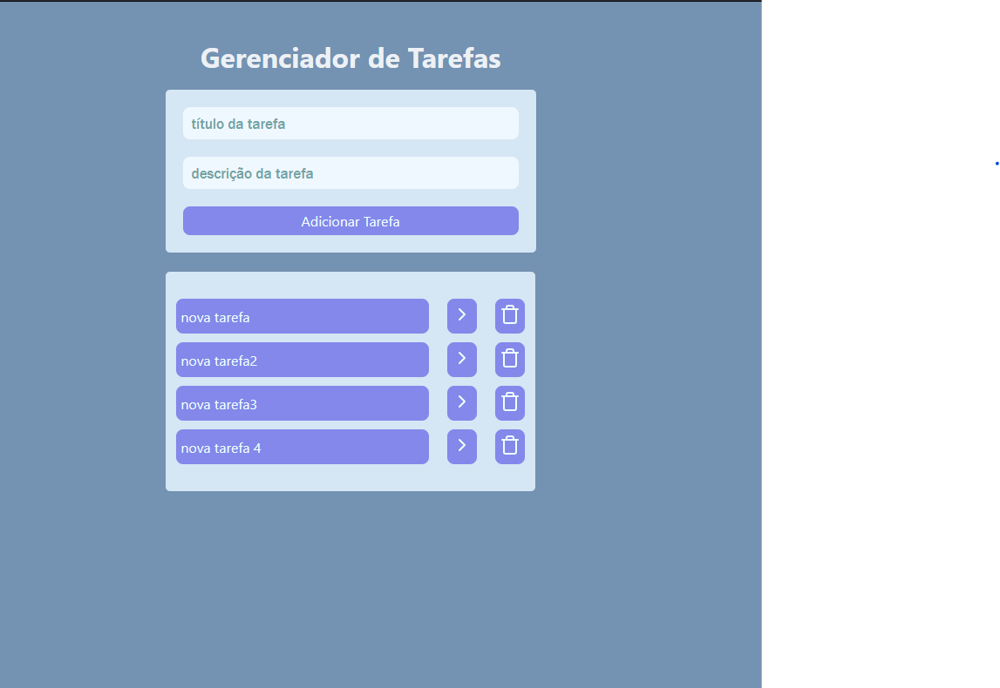

📝 Lista de Tarefas

Aplicação web simples para gerenciamento de tarefas, permitindo adicionar, visualizar ,atualiar, remover e organizar atividades do dia a dia de forma prática.

🚀 Demonstração

🔗 Acesse o projeto online:

https://organizador-de-tarefasls.vercel.app/

📸 Preview

🎯 Funcionalidades
✅ Adicionar novas tarefas
📋 Listar tarefas cadastradas
❌ Remover tarefas
💾 Persistência de dados no navegador (LocalStorage)
⚡ Interface simples e responsiva
🛠️ Tecnologias utilizadas
React.js
JavaScript (ES6+)
HTML5
CSS3
LocalStorage
📦 Como rodar o projeto
# Clone o repositório
git clone https://github.com/jardeljm22/Lista-de-Tarefas.git

# Acesse a pasta
cd Lista-de-Tarefas

# Instale as dependências
npm install

# Rode o projeto
npm run dev
📁 Estrutura do projeto
src/
 ├── components/
 ├── hooks/
 ├── pages/
 ├── services/
 ├── context/
 └── styles/
🧠 Aprendizados

Este projeto foi desenvolvido com foco em:

Manipulação de estado no React
Criação de hooks personalizados
Organização de código em camadas
Persistência de dados no navegador
Boas práticas de componentização
🔮 Melhorias futuras
 Editar tarefas
 Marcar como concluída
 Filtro de tarefas (pendentes/concluídas)
 Integração com API
 Autenticação de usuário
🤝 Contribuição

Contribuições são bem-vindas!

Fork o projeto
Crie uma branch (git checkout -b feature/minha-feature)
Commit (git commit -m 'minha feature')
Push (git push origin minha-feature)
Abra um Pull Request
📄 Licença

Este projeto está sob a licença MIT.

👨‍💻 Autor

Desenvolvido por Jardel Mendes
